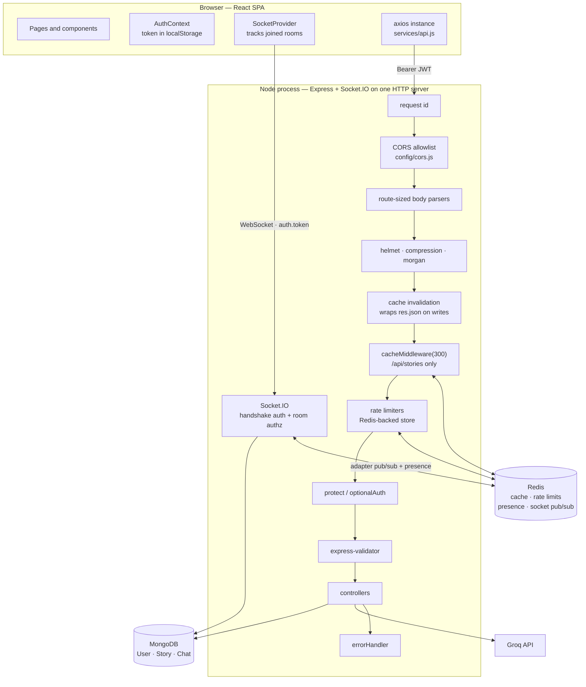

# FailFixes

A full-stack MERN application where people publish stories about setbacks they
have recovered from, follow each other, and message each other in real time.

**Everything in this document is checked against the code.** Where a capability
is missing, partial, or only correct under certain conditions, that is stated in
[Known limitations](#known-limitations) rather than omitted.

---

## Contents

- [Problem](#problem)
- [Features](#features)
- [Architecture](#architecture)
- [Tech stack](#tech-stack)
- [Folder structure](#folder-structure)
- [Authentication](#authentication)
- [Authorization](#authorization)
- [Real-time architecture](#real-time-architecture)
- [Redis architecture](#redis-architecture)
- [Caching strategy](#caching-strategy)
- [Rate limiting](#rate-limiting)
- [MongoDB architecture](#mongodb-architecture)
- [API reference](#api-reference)
- [Socket events](#socket-events)
- [Error handling](#error-handling)
- [Observability](#observability)
- [Environment variables](#environment-variables)
- [Local setup](#local-setup)
- [Tests](#tests)
- [CI/CD](#cicd)
- [Deployment](#deployment)
- [Security](#security)
- [Performance](#performance)
- [Known limitations](#known-limitations)
- [Scaling](#scaling)
- [Future improvements](#future-improvements)

---

## Problem

People learn more from other people's failures than from their successes, but
there is no natural place to write one up. FailFixes is a small social platform
built around that single idea: publish what went wrong and how you recovered,
follow authors whose experience is relevant to you, and talk to them directly.

---

## Features

Each item below maps to code in this repository.

| Feature | Where |
|---|---|
| Register / log in / current user | `backend/controllers/authController.js` |
| Log out with real token revocation | `authController.logout` — increments `tokenVersion` |
| Change password (revokes other sessions) | `authController.changePassword` |
| Story CRUD, likes, comments, view counts | `backend/controllers/storyController.js` |
| Story listing with category, search, sort, pagination | `storyController.getAllStories` |
| Follow / unfollow (one toggle endpoint) | `userController.followUser` |
| Personalised feed of followed authors | `userController.getUserFeed` |
| Dashboard with aggregated stats | `userController.getUserDashboard` |
| User search | `userController.searchUsers` |
| Liked-stories list | `userController.getLikedStories` |
| Direct chats with history and unread counts | `backend/controllers/chatController.js` |
| Read receipts | `chatController.markChatRead` |
| Real-time messaging, typing indicators, presence | `backend/socket/index.js` |
| AI story generation (Groq) | `backend/controllers/siController.js` |

**Not built:** email of any kind (no verification, no password reset), group chat, notifications,
bookmarks (the schema field exists but no endpoint writes it), analytics,
comment editing or deletion, moderation tooling, admin UI. The `role` field
(`user` / `moderator` / `admin`) exists on the User schema but **no route checks
it** — there is no role-based authorization in this application.

---

## Architecture

A **modular monolith**: one Node process serving both the REST API and the
WebSocket layer, one React single-page app, and two backing stores.

There is no service layer. Controllers call Mongoose models directly, and some
domain logic lives on the models as instance methods and statics. This is a
deliberate choice for an application of this size, and it means the layering is
`route → middleware → controller → model`. Nothing in the codebase is a
microservice.



Full component-by-component detail, including failure modes for each,
is in **[docs/ARCHITECTURE.md](docs/ARCHITECTURE.md)**.

---

## Tech stack

**Backend** — Node 22, Express 4, Mongoose 7, Socket.IO 4.8,
`@socket.io/redis-adapter` 8, node-redis 5, jsonwebtoken 9, bcryptjs,
express-validator 7, express-rate-limit 6, helmet 7, cors, compression, morgan,
axios, validator.

**Frontend** — React 18 (Create React App 5), MUI 5 + Emotion,
react-router-dom 6, axios, socket.io-client 4, date-fns.

**Testing / CI** — Jest 29, supertest, socket.io-client, ESLint 8,
GitHub Actions, CodeQL.

**External services** — MongoDB Atlas (production), Redis, Groq
(`llama-3.3-70b-versatile`).

There is **no email**. `utils/emailService.js` (Resend) and the `resend`
dependency were removed in this pass — nothing imported them, and the
verify-email route had already been deleted.

---

## Folder structure

```
backend/
  app.js                  Express app: middleware pipeline, health, routes, 404, error handler
  server.js               Boot: DB → HTTP server → Socket.IO → listen; graceful shutdown
  config/
    env.js                Fail-fast validation of JWT_SECRET and MONGODB_URI
    cors.js               The single origin allowlist, shared with Socket.IO
    config.js             Consolidated env-derived settings
  middleware/
    auth.js               protect / optionalAuth
    cache.js              Redis client lifecycle + response cache
    rateLimit.js          Six tiered limiters
    rateLimitStore.js     Redis store for express-rate-limit, memory fallback
    validation.js         express-validator chains
    errorhandler.js       The single error handler
  controllers/            auth, story, user, chat, si (AI)
  models/                 User, Story, Chat
  routes/                 auth, stories, users, chats, ai
  socket/
    index.js              Handshake auth, adapter, handlers, connection cap
    presence.js           Shared presence + per-account connection counter
  utils/
    token.js              The only place JWTs are signed or verified
    allowedUpdates.js     Field allowlists (mass-assignment defence)
    queryHelpers.js       Regex escaping and type guards for query input
    socketSecurity.js     Room authorization, payload validation, event limits
    database.js           Connection with retry, health check, shutdown
  tests/                  13 Jest suites
  scripts/testPerformance.js   Cache latency probe

frontend/src/
  App.js                  Theme, providers, routes
  context/
    AuthContext.js        Auth state, login/register/logout, boot verification
    SocketContexts.js     Socket lifecycle, presence, room tracking
  services/api.js         The axios instance and every API call
  components/             ProtectedRoute, ErrorBoundary, FollowButton, LikeButton,
                          Comments, UserSuggestions, Story/StoryCard, layout/
  pages/                  Home, Browse, ViewStory, CreateStory, Dashboard,
                          UserProfile, Followers, Following, ChatPage, login, Signup

docs/                     ARCHITECTURE.md, DEBUGGING.md, INTERVIEW_GUIDE.md
.github/workflows/        ci-cd.yml, codeql.yml
```

---

## Authentication

**Stateless JWT with server-side revocation.**

Tokens are signed in `backend/utils/token.js`, which is the only place in the
codebase that calls `jsonwebtoken`. HTTP requests and Socket.IO handshakes go
through the same `verifyAuthToken` and `checkAccountState`, so the two paths
cannot drift.

| Property | Value |
|---|---|
| Algorithm | HS256, pinned on **both** sign and verify |
| Issuer / audience | `failfixes` / `failfixes-api`, both verified |
| Lifetime | 2 days (`JWT_EXPIRE` overrides) |
| Claims | `id`, `username`, `role`, `displayUsername`, `tv` (token version) |
| Storage | `localStorage`, key `ff_token` |
| Transport | `Authorization: Bearer <token>`; sockets use the handshake `auth` object |
| Password hashing | bcrypt, cost 12, in a `pre('save')` hook; field is `select: false` |
| Refresh tokens | **Not implemented** |

### Login

`POST /api/auth/login` → find user by email or username → reject if
`isActive === false` → `bcrypt.compare` → sign token → update `lastLogin` /
`loginCount` → return `{ token, user }`.

Unknown user and wrong password return an **identical** 401, so the endpoint does
not reveal which accounts exist.

### Every authenticated request

`protect` (`backend/middleware/auth.js`) extracts the bearer token, verifies it,
then **loads the user from MongoDB** and runs `checkAccountState`, which rejects:

- a deleted account → `USER_NOT_FOUND`
- `isActive === false` → `ACCOUNT_DEACTIVATED`
- `decoded.tv !== user.tokenVersion` → `TOKEN_REVOKED`

This costs one database read per request and gives up the usual statelessness
benefit of JWTs. It is a deliberate trade: deactivation and revocation take
effect on the next request rather than at token expiry.

### Revocation and logout

`tokenVersion` is an integer on the User document, embedded in every token as
`tv`. Incrementing it invalidates every token issued before the increment.

- `POST /api/auth/logout` increments it.
- `PUT /api/auth/change-password` increments it and returns a fresh token so the
  device making the change stays signed in.

> **Logout signs the account out everywhere, on purpose.** Tokens carry no
> per-session identity — no `jti`, no server-side session record — so revoking
> one device's token without the others is not possible in this design. The
> alternative was a logout that does not revoke anything, which is a security
> control in name only. This is asserted by
> `backend/tests/revocation.test.js`.

Revocation applies to sockets too: a revoked token cannot complete a handshake.

---

## Authorization

There are no roles in use. Authorization is **ownership- and
participation-based**, checked in each controller:

| Resource | Rule | Where |
|---|---|---|
| Story update / delete | `story.author` must equal `req.user._id` | `storyController` |
| Unpublished story | Readable only by its author | `storyController.getStoryById` |
| Story like / comment | Only on `status: 'published'` stories | `storyController` |
| Chat history, read receipts | Caller must be in `chat.participants` | `chatController` |
| Chat room subscription | Same participation check | `utils/socketSecurity.js` |
| Sending a message | Same participation check | `socket/index.js` |
| Profile / story updates | Field **allowlist**, not a blocklist | `utils/allowedUpdates.js` |

Two questions are answered separately and both matter: *who may write* (the
ownership check) and *what they may write* (the allowlist). Without the second,
`$set: req.body` allowed writing `role`, `password` (bypassing the bcrypt hook),
`followers`, `stats`, `author` and `moderationStatus`.

Chat authorization returns the same response for "no such chat" and "not a
participant", so it cannot be used to discover which chat ids exist.

---

## Real-time architecture

Socket.IO is attached to the same HTTP server as Express (`backend/server.js`),
so there is one process and one port.

**Connection lifecycle**

1. Client connects with `io(url, { auth: { token } })`.
2. `socketAuthMiddleware` verifies the token and account state, then sets
   `socket.userId` from the **verified token** — never from an event payload.
3. A second middleware reserves a connection slot against the shared presence
   counter, rejecting the connection past 8 per account.
4. On connect, the socket joins `user_<userId>`. `userOnline` is broadcast only
   if this is the account's **first** live connection anywhere in the cluster.
5. On disconnect the slot is released; `userOffline` fires only on the **last**.

**Rooms** — `user_<userId>` (joined automatically from the verified id) and
`chat_<chatId>` (requires passing `authorizeChat`). There are no namespaces.

**Room membership is an authorization decision.** Joining a chat room subscribes
you to its private message stream, so it is authorized exactly like reading the
conversation over REST.

Messages are **sent over Socket.IO only**. There is no `POST /api/chats/:id/messages`
— a second write path would need its own authorization, validation and broadcast,
and would be a second place for the two to disagree. Chat *history* is read over
HTTP, where pagination is natural.

### Multi-instance

When `REDIS_URL` is set, `initSocket` attaches
`@socket.io/redis-adapter` with a dedicated publisher and subscriber connection,
so a room broadcast from one instance reaches sockets held by another. Presence
and the per-account connection cap use one shared Redis counter
(`presence:conn:<userId>`), so both are cluster-wide rather than per process.

This is verified, not asserted: `backend/tests/socket.multiinstance.test.js`
starts two Socket.IO servers, connects a client to each, and checks that a
message sent on one arrives on the other — plus that the connection cap and
presence announcements behave correctly across both.

**Without `REDIS_URL` the app falls back to the in-memory adapter and is correct
on a single instance only.** The fallback is logged loudly at startup.

Sticky sessions are still required at the load balancer so the
polling-to-WebSocket upgrade reaches the same process.

---

## Redis architecture

Redis is **optional**. With no `REDIS_URL` the application starts and works;
caching is disabled, rate limits become per-process, and Socket.IO is
single-instance. Redis is used for exactly four things:

| Use | Keys | Module |
|---|---|---|
| Response cache | `cache:anon:<url>` | `middleware/cache.js` |
| Rate-limit counters | `rl:<prefix>:<client>` | `middleware/rateLimitStore.js` |
| Presence + connection cap | `presence:conn:<userId>` | `socket/presence.js` |
| Socket.IO broadcast pub/sub | managed by the adapter | `socket/index.js` |

It is **not** used for sessions, queues, or background jobs — there are none in
this application.

---

## Caching strategy

Only `GET /api/stories*` is cached, with a 300-second TTL.

**The rule: only fully anonymous GET responses are cached or served from cache.**
Any request carrying an `Authorization` header or a cookie bypasses the cache in
*both* directions — it neither reads a cached entry nor writes one.

This is stricter than necessary and deliberately so. The story routes use
`optionalAuth` and return per-viewer fields (`isLiked`, `isFollowing`), and
`GET /api/stories/:id` returns an **unpublished draft to its author**. With a
key of `cache:<url>` and no identity component, an author viewing their own draft
populated the cache and the next anonymous visitor received the draft — the cache
layer created an authorization bypass. Logged-in users lose cache hits; anonymous
traffic, which dominates a public story site, keeps them.

`Vary: Authorization` is set on every response from a cached route — including
when Redis is down — so a CDN or reverse proxy cannot reintroduce the same bug.

**Invalidation** — a successful 2xx write whose URL contains `/stories` or
`/users` clears matching keys with `SCAN` + `DEL` (never `KEYS`, which blocks the
Redis event loop). Invalidation is fire-and-forget: a Redis failure must not fail
a write that already succeeded. The TTL is the backstop — a stale entry cannot
outlive 300 seconds.

**Observability** — every cached-route response carries `X-Cache-Status`
(`HIT` / `MISS` / `BYPASS`) and `X-Response-Time`, both exposed to the browser.

Regression tests: `backend/tests/cache.security.test.js`.

---

## Rate limiting

Seven tiers, sized by what a request actually costs, not one global number.

| Limiter | Applies to | Limit | Keyed by |
|---|---|---|---|
| `preAuthLimiter` | runs **before** `auth` on `/auth/logout`, `/auth/change-password`, `/users/search`, `/users/me/liked` | 600 / min | IP |
| `authLimiter` | register, login, change-password | 10 / 15 min | IP |
| `aiLimiter` | `POST /api/ai/generate-story` | 20 / hour | user id |
| `writeLimiter` | story/comment/follow/profile writes, chat create, mark-read, logout | 100 / 15 min | user id |
| `viewLimiter` | `POST /api/stories/:id/view` | 120 / 5 min | IP |
| `searchLimiter` | story listing, user search, suggestions, chat reads, liked stories | 100 / 5 min | user id or IP |
| `globalLimiter` | backstop (defined, not currently mounted) | 1000 / 15 min | IP |

All are overridable by environment variable (see below).

**Two layers, not one.** `protect` verifies a JWT and then issues a
`User.findById()`, so a limiter placed *after* it bounds the controller but not
that work — a caller could force one signature check and one database read per
request indefinitely, including on requests ultimately answered `429`. On the
four routes above, an IP-keyed gate therefore runs *before* `auth`, and the
user-aware limiter still runs *after* it:

```
request → preAuthLimiter (IP) → auth → writeLimiter/searchLimiter (user) → controller
```

The gate cannot be user-keyed — it runs before `req.user` exists, which is
precisely the point. Its budget is deliberately generous (10/sec per IP) so a
shared office or carrier-grade NAT is never throttled; it exists to blunt a
flood by orders of magnitude, not to shape normal traffic. The user-aware
limiters are what provide per-account fairness, and the gate does not replace
them. Ordering is asserted by `backend/tests/ratelimit.contract.test.js` and the
runtime behaviour by `backend/tests/preauth.runtime.test.js`.

**Storage** — counters live in Redis when `REDIS_URL` is set, so a limit survives
a restart and is shared across instances. Each limiter has its own key prefix so
two limiters never share a counter for the same client.

**Failure behaviour** — if Redis is unconfigured or unreachable, the store
transparently falls back to an in-memory counter. Limits become per-process and
reset on restart, which is exactly the protection the app had before; a request
is **never** failed because the rate-limit store is down.

**Algorithm** — fixed window (`INCR` plus a TTL set on first use). A fixed window
permits up to 2× the limit across a boundary; acceptable for abuse control.

`app.set('trust proxy', 1)` is required for IP keying to work behind Render's
proxy — without it every request appears to come from the proxy.

Tests: `backend/tests/rateLimitStore.test.js`, `backend/tests/ratelimit.test.js`.

---

## MongoDB architecture

Three models.

**User** — identity, profile, denormalised `stats` counters, and the social graph
as arrays on both sides (`followers`, `following`, `likedStories`). `email` is
unique; `username` is unique **and sparse** (optional). `password` is
`select: false`. `toJSON` strips `password` and `tokenVersion`.

**Story** — the story plus its engagement: `comments` as embedded subdocuments,
`likes` and `bookmarks` as ObjectId arrays. Author identity is stored twice:
`author` (reference) and `authorUsername` (denormalised for read speed). A
`pre('save')` hook generates the slug, excerpt and read time, and syncs `stats`
counters from array lengths. 16 indexes plus a text index.

**Chat** — `participants`, `messages` as embedded subdocuments each carrying
`readBy: [{ user, readAt }]`, and a denormalised `lastMessage` so the chat list
renders without touching the message array.

**Query safety** — `utils/queryHelpers.js` escapes regexes and type-guards every
externally supplied filter. Express parses `?category[$ne]=x` into an object, and
`asString()` drops anything that is not a plain string, so a MongoDB operator
cannot be injected through a query parameter. Usernames are matched with escaped,
length-capped regexes.

**Read-path efficiency** — the chat list computes unread counts inside MongoDB
and projects the message array away; message and comment pagination use `$slice`
inside an aggregation rather than loading whole arrays into Node.

The real design limitations of this schema are documented in
[Known limitations](#known-limitations).

---

## API reference

Base path `/api`. All responses are JSON with a `success` boolean; errors carry a
stable `code` and, since this pass, a `requestId`.

### Auth

| Method | Path | Auth | Notes |
|---|---|---|---|
| POST | `/auth/register` (alias `/auth/signup`) | – | Does **not** return a token |
| POST | `/auth/login` | – | `{ identifier, password }` — identifier is email *or* username |
| GET | `/auth/me` | ✅ | |
| POST | `/auth/logout` | ✅ | Revokes **all** sessions for the account |
| PUT | `/auth/change-password` | ✅ | Revokes other sessions, returns a new token |

### Stories

| Method | Path | Auth | Notes |
|---|---|---|---|
| GET | `/stories` | optional | `?category&search&sortBy&page&limit&authorUsername`. Cached for anonymous callers |
| GET | `/stories/:id` | optional | Returns a draft only to its author |
| GET | `/stories/author/:authorUsername` | optional | |
| POST | `/stories` | ✅ | |
| PUT | `/stories/:id` | ✅ | Author only; field allowlist |
| DELETE | `/stories/:id` | ✅ | Author only |
| PATCH | `/stories/:id/like` | ✅ | Toggle |
| POST | `/stories/:id/comment` | ✅ | |
| GET | `/stories/:id/comments` | optional | Paginated |
| POST | `/stories/:id/view` | – | Rate-limited counter increment |

### Users

| Method | Path | Auth | Notes |
|---|---|---|---|
| GET | `/users/profile/:username` | optional | |
| POST | `/users/profile/:userId/view` | ✅ | |
| POST | `/users/:username/follow` | ✅ | **Toggle** — response `isFollowing` reports the result |
| GET | `/users/:username/followers` / `/following` | optional | Paginated |
| GET | `/users/dashboard` | ✅ | |
| GET | `/users/suggested` | ✅ | |
| GET | `/users/search?q=` | ✅ | |
| GET | `/users/me/feed` | ✅ | Stories by followed authors |
| GET | `/users/me/stats` / `/me/stories` / `/me/liked` | ✅ | |
| GET | `/users/me/profile` · PUT `/users/me/profile` | ✅ | Field allowlist on write |

### Chats

| Method | Path | Auth | Notes |
|---|---|---|---|
| GET | `/chats` | ✅ | With unread counts; message bodies excluded |
| POST | `/chats/direct` | ✅ | `{ userId }`; returns the existing chat if there is one |
| GET | `/chats/:chatId/messages` | ✅ | Participants only; paginated |
| PUT | `/chats/:chatId/read` | ✅ | Idempotent; does not reorder the chat list |

Messages are **sent over Socket.IO**, not HTTP.

### AI

| Method | Path | Auth | Notes |
|---|---|---|---|
| POST | `/ai/generate-story` | ✅ | `{ prompt }`, 3–2000 chars; 20/hour |

### Health

`GET /` · `GET /health` (shallow) · `GET /api/health` (pings Redis, reports
memory and per-feature status). `GET /api/cache/stats` and
`DELETE /api/cache/clear` exist in **development only**.

A contract test (`backend/tests/routes.contract.test.js`) parses the frontend API
client and asserts every URL it can call is a registered route, so this table
cannot silently drift again.

---

## Socket events

**Client → server**

| Event | Payload | Guards |
|---|---|---|
| `joinChat` | `chatId` | 60/60s · valid ObjectId · participation |
| `joinChats` | `chatId[]` | 10/60s · max 50 · participation, batched |
| `leaveChat` | `chatId` | 60/60s |
| `sendMessage` | `{ chatId, content, messageType }` | 30/10s · 1–1000 chars · type must be `text` · participation |
| `typing` | `{ chatId, isTyping }` | 60/10s · participation · fails silently |

**Server → client**

`newMessage` · `userTyping` · `userOnline` · `userOffline` · `chatJoined` ·
`chatsJoined` (lists only the ids you were authorized for) ·
`error` (`{ message, code, retryAfterMs? }`).

Error codes: `INVALID_PAYLOAD`, `CHAT_NOT_FOUND`, `FORBIDDEN`, `RATE_LIMITED`,
`TOO_MANY_CHATS`, `JOIN_FAILED`, `SEND_FAILED`.

The client tracks joined rooms and re-joins them on reconnect
(`SocketContexts.js`); the server re-authorizes every id, so this cannot be used
to rejoin a room access has been lost to.

---

## Error handling

One error handler (`backend/middleware/errorhandler.js`). `classify()` maps error
shapes onto safe responses:

| Condition | Status | Code |
|---|---|---|
| Mongoose `ValidationError` | 400 | `VALIDATION_ERROR` |
| `CastError` | 400 | `INVALID_ID` |
| Malformed JSON | 400 | `INVALID_JSON` |
| Duplicate key (11000) | 409 | `DUPLICATE_KEY` |
| `JsonWebTokenError` / `TokenExpiredError` | 401 | `INVALID_TOKEN` / `TOKEN_EXPIRED` |
| Body too large | 413 | `PAYLOAD_TOO_LARGE` |
| Mongo connection errors | 503 | `DB_UNAVAILABLE` |
| Upstream timeout | 504 | `TIMEOUT` |
| Anything else | 500 | `INTERNAL_ERROR` |

**Never** returned to a client: stack traces, Mongoose schema paths, driver
messages (they can disclose replica-set hosts), or upstream provider messages. A
5xx body is generic in every environment; outside production it carries a `debug`
field with the message but still no stack.

Validation errors never echo the value of a `password`-family field — a too-short
password used to be reflected in the 400 body and printed to the log.

---

## Observability

- **Access logs** — morgan, with the request id on every line.
- **Request ids** — every request gets one (or reuses a sanitised inbound
  `X-Request-Id`), returned as a response header and included in error bodies as
  `requestId`. The same id appears on the access-log line and the error-log line,
  so a user-reported failure can be traced to one server-side stack.
- **Error logs** — `{ requestId, method, url, status, name, userId }`, plus the
  stack for 5xx only.
- **Health** — `GET /api/health` reports uptime, memory, Redis connectivity with
  a ping time, and per-feature status.
- **Response headers** — `X-Request-Id`, `X-Cache-Status`, `X-Response-Time`,
  `RateLimit-*`.

Not implemented: structured JSON logging, log aggregation, metrics, tracing,
alerting, error tracking.

---

## Environment variables

### Backend

| Variable | Required | Default | Purpose |
|---|---|---|---|
| `MONGODB_URI` | **yes** | – | Validated at startup; process exits if absent or malformed |
| `JWT_SECRET` | **yes** | – | Must be ≥32 chars, not a known placeholder, ≥8 distinct characters. **No fallback** |
| `PORT` | no | `5000` | |
| `NODE_ENV` | no | `development` | |
| `REDIS_URL` | no | – | Absent ⇒ no cache, per-process rate limits, single-instance sockets |
| `FRONTEND_URL` | no | – | Extra CORS origin |
| `CORS_ORIGIN` | no | – | Extra CORS origins, comma-separated |
| `JWT_EXPIRE` | no | `2d` | |
| `GROQ_API_KEY` | no | – | Absent ⇒ AI endpoint returns 503 |
| `RATE_LIMIT_WINDOW_MS`, `AUTH_RATE_LIMIT_MAX`, `AI_RATE_LIMIT_*`, `WRITE_RATE_LIMIT_*`, `VIEW_RATE_LIMIT_*`, `SEARCH_RATE_LIMIT_*`, `PREAUTH_RATE_LIMIT_*`, `RATE_LIMIT_MAX_REQUESTS` | no | see table above | Raise `PREAUTH_RATE_LIMIT_MAX` behind unusually dense NAT |
| `DB_MAX_POOL_SIZE` / `DB_MIN_POOL_SIZE` | no | `10` / `1` | |

`RESEND_API_KEY` is read by `utils/emailService.js`, which nothing imports.

### Frontend

| Variable | Purpose |
|---|---|
| `REACT_APP_API_URL` | API base URL **including** `/api`. The socket URL is derived by stripping the trailing `/api` |

`REACT_APP_SOCKET_URL` appears in `.env` but **is not read by any code**.

> `REACT_APP_*` values are inlined at **build** time and are public. Changing one
> in production requires a rebuild, not a restart. Never put a secret behind this
> prefix — CI greps the built bundle for credential-shaped strings.

---

## Local setup

**Prerequisites** — Node 22.x with npm 10.9.x (enforced: `.nvmrc`, `engines`, and
`engine-strict=true` in `frontend/.npmrc`; npm 11 resolves peers differently and
breaks `npm ci`), a local MongoDB, and optionally Redis.

```bash
# Backend
cd backend
npm ci
cat > .env <<'EOF'
PORT=5000
NODE_ENV=development
MONGODB_URI=mongodb://127.0.0.1:27017/failfixes
JWT_SECRET=<generate below>
REDIS_URL=redis://127.0.0.1:6379
FRONTEND_URL=http://localhost:3000
EOF
node -e "console.log(require('crypto').randomBytes(48).toString('base64url'))"  # JWT_SECRET
npm run dev

# Frontend
cd ../frontend
npm ci
echo 'REACT_APP_API_URL=http://localhost:5000/api' > .env
npm start
```

Backend on `http://localhost:5000`, frontend on `http://localhost:3000`.
Verify with `curl localhost:5000/api/health`.

Redis is optional — without it the server logs
`Redis URL not provided - caching disabled` and runs normally.

---

## Tests

```bash
cd backend  && npm test          # 13 suites, 278 tests
cd backend  && npm run lint
cd frontend && CI=true npm test -- --watchAll=false
cd frontend && npm run build
```

The backend suite is predominantly **security and regression** tests:

| Suite | Covers |
|---|---|
| `security.test.js` | Mass assignment, IDOR, JWT verification, revocation, NoSQL/regex injection, error leakage, password handling |
| `revocation.test.js` | `tokenVersion` end to end, over HTTP **and** the socket handshake |
| `cache.security.test.js` | Cache isolation — the draft-leak scenario, against real Redis |
| `socket.security.test.js` | Room authorization, payload validation, event limits |
| `socket.multiinstance.test.js` | Cross-instance broadcast, cluster-wide connection cap, presence |
| `rateLimitStore.test.js` | Shared counters, window expiry, memory fallback |
| `chat.test.js` | Read receipts, unread counts, participation checks |
| `routes.contract.test.js` | Every frontend URL is a registered backend route |
| `ratelimit.test.js`, `auth.test.js`, `story.test.js`, `user.test.js`, `api.test.js` | Endpoint behaviour |

### Test-database safety

`backend/tests/setup/guardTestDatabase.js` runs via Jest `setupFiles`, before any
test module loads, and **refuses to run** unless `NODE_ENV=test`, the Mongo host
is local (or a CI service container), and the database name contains `test`.
`mongodb+srv://` is rejected outright.

It exists because `.env` and `.env.test` once held an identical `MONGODB_URI`
pointing at the production cluster, while the suites run `deleteMany()` in
`beforeAll`/`afterAll` — every `npm test` was issuing destructive writes against
live data. The escape hatch is deliberately awkward:
`ALLOW_REMOTE_TEST_DB=yes-i-understand-the-risk`.

Suites that need real Redis self-skip when none is reachable.
`--maxWorkers=1` because the suites share one database.

---

## CI/CD

`.github/workflows/ci-cd.yml` runs on push and pull request to `main` and
`develop`. Four jobs, **in parallel** (no `needs:` between them):

| Job | Does | Blocking |
|---|---|---|
| `backend-test` | MongoDB 6 + Redis 7 service containers, ephemeral JWT secret, `npm run test:ci`, Codecov upload | ✅ (upload is not) |
| `backend-lint` | `eslint .` | ✅ |
| `frontend-build` | `npm test`, then `CI=false npm run build`, then a credential scan of the bundle, then artifact upload | ✅ |
| `dependency-audit` | `npm audit --omit=dev --audit-level=high` | Backend ✅ / frontend ✗ |

`.github/workflows/codeql.yml` runs `security-extended` on `main` and weekly.

Notable choices:

- **Actions pinned to commit SHAs**, not tags — a tag is mutable and can be
  repointed by whoever controls the action repository.
- **`permissions: contents: read`** at workflow level; CodeQL opts back in to
  `security-events: write` at job level.
- **An ephemeral JWT secret per run**, generated and `::add-mask::`-ed, so the
  test job never receives the production signing key.
- **A bundle credential scan** — anything shipped to a browser is public.
- **`CI=false` on the frontend build** downgrades ~40 unused-import lint
  warnings; a genuine compile error still fails the job.
- **The frontend audit ends in `|| true`** — remaining advisories are in the CRA
  build toolchain, whose only fix is a framework migration. A permanently-red job
  trains people to ignore it.

---

## Deployment

**There is no deployment configuration in this repository.** No Dockerfile, no
`render.yaml`, no `vercel.json`, and no deploy job in CI.

Both services run on Render, deployed by Render's GitHub integration on a push to
`main`. Build command, start command, environment variables and health-check path
are configured in the Render dashboard and are **not version-controlled**.

This is a real limitation: the deployment is not reproducible from the repository
alone. It is recorded here rather than hidden, and moving it into the repo is
listed under [Future improvements](#future-improvements).

What the code *does* assume about its host: TLS terminated upstream
(`trust proxy` is 1, HSTS is set), `PORT` from the environment, binding
`0.0.0.0`, and SIGTERM handled for graceful shutdown.

---

## Security

Implemented controls, each with the reason it exists:

| Control | Protects against |
|---|---|
| Fail-fast secret validation (`config/env.js`) | A predictable `JWT_SECRET` lets anyone mint a token for any user |
| HS256 pinned on verify, plus `iss`/`aud` | `alg: none` and algorithm-confusion attacks; tokens from another system |
| bcrypt cost 12, `select: false` | Offline cracking; accidental hash disclosure |
| `tokenVersion` revocation | A stolen token being valid for its full lifetime |
| Field allowlists | Mass assignment — privilege escalation and cleartext password writes |
| Type guards + escaped regexes | NoSQL operator injection and ReDoS |
| Anonymous-only cache + `Vary` | A cache serving one user's private data to another |
| Socket room authorization | Reading a stranger's private conversation |
| Identity from handshake, never payload | Message sender spoofing |
| Tiered rate limits (Redis-backed) | Credential stuffing, denial-of-wallet on the LLM proxy |
| Per-account socket cap | Multiplying the per-socket event budget |
| CORS allowlist that fails closed | A missing `NODE_ENV` silently disabling origin checks |
| helmet (CSP, HSTS, referrer policy) | Header-level hardening |
| Route-sized body limits | Cheap resource exhaustion on bcrypt and LLM endpoints |
| Generic 5xx bodies, no stacks | Disclosure of schema paths, hosts and filesystem layout |
| No password values in logs or responses | Credential leakage into log streams |
| SHA-pinned actions, least-privilege token, bundle secret scan | CI supply-chain compromise, secrets in client bundles |

**CSRF** does not apply: the token travels in an `Authorization` header, which a
cross-site form cannot set, and cross-origin XHR is gated by the CORS allowlist.
`withCredentials` in the axios instance is vestigial — no cookie auth exists.

**XSS is the real threat model**, because the token is in `localStorage`. See
[Known limitations](#known-limitations).

---

## Performance

Measured with `backend/scripts/testPerformance.js`, which takes 40 samples per
condition after 5 warm-up requests, reports median and p95, and **verifies via
`X-Cache-Status` that the cached run was actually a cache hit** — without that
check the script cannot tell a cache hit from a fast database.

On a local machine (loopback, local MongoDB and Redis, 500 seeded stories,
single client, no concurrency):

| | median | p95 |
|---|---|---|
| Uncached (`MISS`, cache cleared each request) | 4.0 ms | 5.4 ms |
| Cached (`HIT`) | 1.4 ms | 1.7 ms |

≈64% lower median latency, ≈2.8×. **These are local numbers on an idle machine
and are not a benchmark** — no concurrency, one endpoint, one host. Re-run the
script on your own hardware before quoting anything.

> A previous version of this README claimed "57% faster (342ms → 146ms), 2.34×".
> That came from a two-request script which read `response.data.data` while the
> endpoint returns `{ stories }`, so it reported zero stories on both runs. The
> script has been rewritten and the numbers above replace it.

Other applied optimisations: unread counts and message/comment pagination
computed inside MongoDB rather than in Node; three compound indexes added to
serve the listing sorts (the default listing previously did a collection scan
plus an in-memory sort); `Promise.all` for independent queries; `lean()` on read
paths; response compression.

---

## Known limitations

Honest list. Several of these are things an interviewer would find anyway.

**Authentication**
- The token lives in `localStorage`, so any XSS on the frontend origin yields a
  valid token. The control that matters is a Content-Security-Policy on the
  static host serving the SPA, and **that is not in this repository** — the CSP
  in `app.js` applies to a JSON API that renders no HTML.
- No refresh tokens. Sessions are a single 2-day access token.
- Logout is all-or-nothing (see [Authentication](#authentication)).
- Password minimum is 6 characters, with no complexity or breach check.

**Data model**
- `Story.comments`, `Story.likes` and `Chat.messages` are **unbounded embedded
  arrays**. MongoDB caps a document at 16MB, so a very active story or chat will
  eventually hit a hard write failure. Read paths already avoid loading them
  whole, but the correct fix is separate collections.
- `likeStory` is a read-modify-write on the document, so concurrent likes can
  lose an update and `stats.likes` can drift from `likes.length`.
- `followUser` performs a check-then-act plus two independent updates with **no
  transaction**, so concurrent follows can double-count `followersCount` and a
  partial failure leaves the graph inconsistent.
- `authorUsername` is denormalised at creation and never updated, so renaming a
  user breaks the feed for their existing stories (the feed queries by username,
  not id).
- `Story.bookmarks` and `moderationStatus` have no endpoints behind them.

**Real-time**
- No delivery guarantees: a message is persisted then broadcast, with no
  acknowledgements and no server-side retry. A crash between the two loses the
  notification (not the message).
- If a process is killed without running its disconnect handlers, its share of
  the presence counters is not decremented; those users appear online until the
  12-hour key TTL expires.

**Operations**
- Deployment is not in the repository (see [Deployment](#deployment)).
- No structured logging, metrics, tracing, alerting, or error tracking.
- Two `connectDB` implementations exist (`db.js` is unused; `utils/database.js`
  is the live one), and three modules register signal handlers, which race on
  shutdown.
- `POST /api/stories/:id/view` is unauthenticated, so view counts can be inflated
  within the rate limit; `getStoryById` also increments, so a story open can be
  counted twice.
- The frontend build emits ~40 lint warnings (unused imports, exhaustive-deps).

---

## Scaling

In the order things actually break:

1. **Socket layer — solved.** Rooms, presence and the connection cap are shared
   through Redis, so a second instance is correct. Requires sticky sessions at
   the load balancer.
2. **Rate limits — solved.** Counters are shared, so limits do not multiply by
   instance count.
3. **Stateless HTTP** scales horizontally today behind a load balancer using
   `/api/health` as the check.
4. **Reads** — widen caching beyond anonymous `/api/stories`; a CDN can sit in
   front (`Vary: Authorization` is already correct for this).
5. **Database** — read replicas for listings (`readPreference` is `primary`
   today), a larger connection pool than 10, and cursor pagination to replace
   `skip`, which walks and discards every skipped document.
6. **Schema** — move messages and comments to their own collections before
   anyone reaches the 16MB document ceiling.
7. **Feed** — currently fan-out-on-read by username. At scale this becomes
   fan-out-on-write into a per-user feed, with a read-time exception for
   high-follower accounts.

---

## Future improvements

Roughly in value order:

1. A Content-Security-Policy on the frontend origin — the missing half of the
   `localStorage` token trade-off.
2. Short-lived access tokens plus a rotating refresh token in an httpOnly
   cookie, which also makes per-device logout possible.
3. Move `Chat.messages` and `Story.comments` into their own collections.
4. Make `likeStory` atomic and `followUser` transactional.
5. Deployment as code — a `render.yaml` or a container image built in CI.
6. Structured JSON logging shipped somewhere queryable, plus error tracking.
7. An OpenAPI spec, so contract drift is caught by a tool rather than by a user.
8. Cursor pagination; use the existing `$text` index instead of regex search.
9. Extract a service layer from the two 1000-line controllers.
10. Password policy: longer minimum plus a breach check.

---

## License

MIT.
