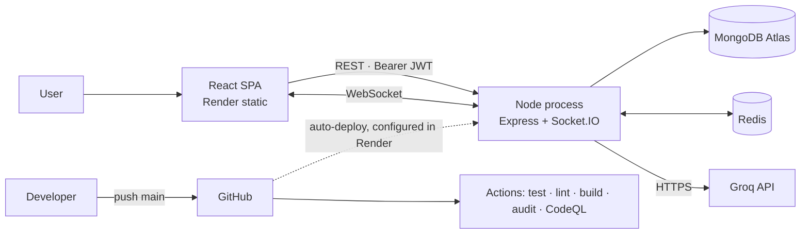
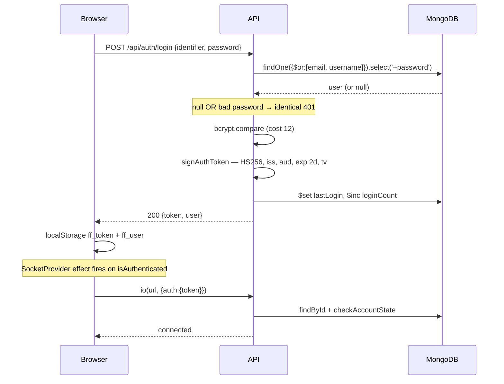
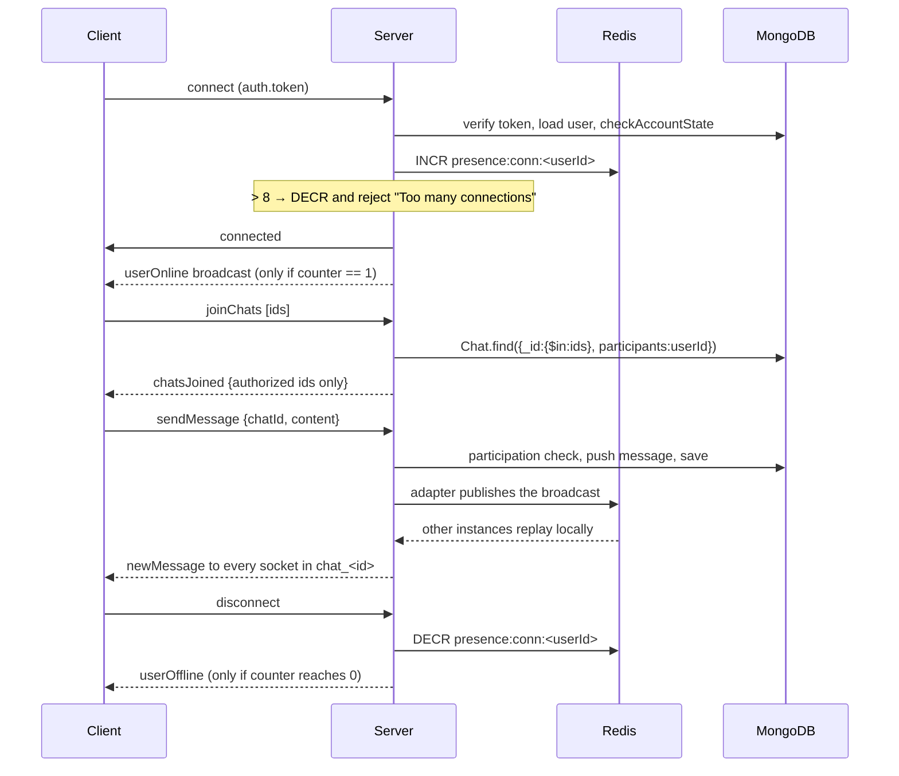

# Architecture

How FailFixes is put together, why each piece is there, and what happens when
each one fails. Every claim here is traceable to a file in this repository.

---

## 1. System overview

One React single-page application and one Node process. The Node process serves
the REST API (Express) and the WebSocket layer (Socket.IO) from the **same HTTP
server**, so there is one port, one deploy and one set of models.

**Classification: modular monolith.** Not microservices, not MVC (there is no
server-rendered view), and not controller–service–repository. The layering is:

```
route → middleware → controller → Mongoose model → MongoDB
```

There is no service layer. Business logic lives in the controllers, with some
domain behaviour on the models as instance methods (`comparePassword`,
`toggleLike`) and statics (`findTrending`, `searchStories`). For an application
of this size that is a deliberate trade — fewer indirections against larger
controller files. The cost is visible: `storyController.js` and
`userController.js` are each around 1000 lines, and shared filter-building had to
be extracted into a helper (`buildUserStoryFilter`) once it had been duplicated
four times.



---

## 2. Components

Each component below lists **purpose → inputs → outputs → dependencies →
failure modes → where to debug**.

### 2.1 Environment validation — `backend/config/env.js`

- **Purpose** — refuse to start with a missing or weak signing key rather than
  fall back to a default. A predictable `JWT_SECRET` means anyone can mint a
  token for any user.
- **Inputs** — `process.env`.
- **Outputs** — nothing, or `process.exit(1)` with a message.
- **Dependencies** — none. It is the first thing `app.js` runs.
- **Rejects** — a secret that is absent, under 32 characters, a known
  placeholder (`secret`, `changeme`, …), or has fewer than 8 distinct characters
  (which catches `aaaaaaaa…` padding). Also a missing or malformed `MONGODB_URI`.
- **Failure mode** — the process exits immediately at boot. On a platform this
  looks like a crash loop.
- **Debug** — the last lines before exit say exactly which check failed. The
  secret's value is never printed. Check length without printing it:
  `node -e "console.log((process.env.JWT_SECRET||'').length)"`.

### 2.2 CORS allowlist — `backend/config/cors.js`

- **Purpose** — one origin allowlist shared by Express **and** Socket.IO, so the
  two cannot drift.
- **Inputs** — the request `Origin` header, `FRONTEND_URL`, `CORS_ORIGIN`,
  `NODE_ENV`.
- **Outputs** — CORS headers, or their absence.
- **Behaviour** — `callback(null, false)` for an unknown origin, which **omits**
  the CORS headers rather than throwing. The request still reaches the route; the
  browser blocks the client from reading the response. Requests with no `Origin`
  (curl, health checks) are allowed — CORS is a browser control.
- **Fails closed.** The previous version ended in
  `callback(null, process.env.NODE_ENV !== "production")`, so a missing or
  misspelled `NODE_ENV` silently allowed every origin while `credentials: true`
  stayed on.
- **Failure mode** — a legitimate frontend origin missing from the list. Note
  that localhost origins are excluded in production.
- **Debug** — outside production the server logs `CORS: refused origin <x>`. If
  that line is absent, the problem is not CORS.

### 2.3 Request pipeline — `backend/app.js`

Order is load-bearing. From first to last:

| # | Middleware | Why it is here |
|---|---|---|
| 1 | `validateEnvOrExit()` | Before anything is wired |
| 2 | `initRedis()` | Non-blocking; connects in the background |
| 3 | `trust proxy = 1` | `req.ip` must be the real client for IP rate limiting |
| 4 | `cors` | Reject unknown origins before doing work |
| 5 | Request id | So every later log line can be correlated |
| 6 | Route-sized `express.json` | First match wins, so tight limits are registered first |
| 7 | `helmet`, `compression`, `morgan` | Headers, gzip, access log |
| 8 | Cache invalidation wrapper | Must precede the routers — see below |
| 9 | Routers | Each applies limiter → validator → auth → controller |
| 10 | 404 handler | |
| 11 | `errorHandler` | Identified by its four-argument arity |

**Body limits** are per route: `/api/auth` 16kb, `/api/ai` 32kb, `/api/chats`
32kb, `/api/users` 64kb, `/api/stories` 512kb, fallback 256kb. This is a
denial-of-service control — a 10MB body on `/api/auth/login` costs a cost-12
bcrypt.

**The invalidation wrapper must be registered before the routers.** It replaces
`res.json` so a successful write can clear the cache. It was previously mounted
*after* them, where it never executed at all — a route handler ends the response
and later middleware never runs.

### 2.4 Authentication — `backend/utils/token.js`, `backend/middleware/auth.js`

- **Purpose** — one implementation of signing and verification, shared by HTTP
  and WebSocket paths.
- **Inputs** — `Authorization: Bearer <token>` (HTTP) or `socket.handshake.auth.token`.
- **Outputs** — `req.user` (a Mongoose document) or a 401/403 with a `code`.
- **Dependencies** — `JWT_SECRET`, MongoDB.
- **Failure modes** — expired token, wrong secret after a redeploy, wrong
  issuer/audience, deleted or deactivated account, revoked token version, or
  MongoDB being unreachable (which surfaces as `AUTH_ERROR` 500).
- **Debug** — read the `code` field: `NO_TOKEN`, `TOKEN_EXPIRED`,
  `INVALID_TOKEN`, `USER_NOT_FOUND`, `ACCOUNT_DEACTIVATED`, `TOKEN_REVOKED`.

`optionalAuth` is the same logic that never fails — used by public endpoints that
enrich their response for a logged-in caller (`isLiked`, `isFollowing`). A bad
token is ignored, but a **deactivated or revoked** account is still refused, so
it cannot receive personalised data.

### 2.5 Response cache — `backend/middleware/cache.js`

- **Purpose** — serve the public story listing without touching MongoDB.
- **Inputs** — `GET` requests on `/api/stories*`.
- **Outputs** — a cached body, or a pass-through that populates the cache; plus
  `X-Cache-Status` and `X-Response-Time`.
- **Dependencies** — Redis (optional).
- **Rule** — only fully anonymous GETs are cached, in either direction. The
  predicate (`evaluateCacheability`) inspects the **raw request**, not `req.user`,
  because the cache runs before `optionalAuth` populates it.
- **Failure modes** — Redis down (falls through to the database, no error);
  invalidation failing (bounded by the 300s TTL); a CDN in front ignoring `Vary`.
- **Debug** — `X-Cache-Status`; `GET /api/cache/stats` in development.

### 2.6 Rate limiting — `backend/middleware/rateLimit.js` + `rateLimitStore.js`

- **Purpose** — bound abuse per concern, not with one global number.
- **Inputs** — `req.ip` (behind `trust proxy`) or `req.user._id`.
- **Outputs** — 429 with a `code` and `retryAfter`, plus `RateLimit-*` headers.
- **Dependencies** — Redis (optional).
- **Failure mode** — Redis unavailable ⇒ transparent fallback to an in-memory
  counter. Limits become per-process and reset on restart. **A request is never
  failed because the store is down.**
- **Known weakness** — fixed window allows up to 2× the limit across a boundary.
- **Debug** — the `code` says which limiter fired. `redis-cli KEYS 'rl:*'`.

### 2.7 Socket layer — `backend/socket/index.js`, `presence.js`, `utils/socketSecurity.js`

- **Purpose** — authenticated, authorized real-time messaging.
- **Inputs** — a handshake token; then `joinChat`, `joinChats`, `leaveChat`,
  `sendMessage`, `typing`.
- **Outputs** — `newMessage`, `userTyping`, `userOnline`, `userOffline`,
  `chatJoined`, `chatsJoined`, `error`.
- **Dependencies** — MongoDB; Redis (optional, for multi-instance).
- **Trust model** — the handshake establishes identity once as `socket.userId`.
  **Every handler derives the acting user from that, never from the payload.**
  `sendMessage` sets `sender: socket.userId` and ignores any `data.sender`.
- **Failure modes** — auth failure (one generic message for every cause, so an
  unauthenticated caller learns nothing); connection cap reached; Redis adapter
  unavailable at startup (falls back to in-memory, logged loudly); a process
  killed without running disconnect handlers, leaving presence counters inflated
  until their 12-hour TTL.
- **Debug** — see `docs/DEBUGGING.md` §Socket.

### 2.8 Error handling — `backend/middleware/errorhandler.js`

- **Purpose** — one place that decides what a client is allowed to see.
- **Contract** — clients get `{ success, message, code?, errors?, requestId }`;
  diagnostics go to the log only. A 5xx body is generic in every environment.
- **Never leaked** — stack traces, Mongoose schema paths, driver messages (which
  can contain the replica-set host), upstream provider messages, or any
  password value.

---

## 3. Request flow

`PUT /api/stories/:id` — the most instructive path, because it exercises both
authorization questions.

```
axios → Authorization: Bearer <token>
  → cors (origin allowlist)
  → request id assigned, X-Request-Id set
  → express.json({ limit: '512kb' })
  → helmet · compression · morgan
  → cache-invalidation wrapper installs on res.json (method is PUT)
  → protect        : verify token → load user → checkAccountState → req.user
  → writeLimiter   : 100 / 15 min, keyed u:<id>
  → validateObjectId, validateStoryUpdate
  → storyController.updateStory
      → Story.findById
      → ownership check: story.author === req.user._id, else 403   [WHO]
      → buildAllowedUpdate(req.body, STORY_UPDATE_SPEC)             [WHAT]
          any rejected key → 400 FORBIDDEN_FIELDS, nothing applied
      → findByIdAndUpdate({ $set: dottedPaths }, { runValidators: true })
  → res.json → wrapper sees 2xx on a /stories URL
      → invalidateCache('/api/stories*') → SCAN + DEL   (fire-and-forget)
```

Allowlisted updates are flattened to **dotted paths** on purpose:
`$set: { preferences: {...} }` replaces the whole subdocument and silently wipes
sibling fields; `$set: { 'preferences.showEmail': true }` updates in place.

---

## 4. Authentication flow



Every subsequent authenticated request repeats verify → load user →
`checkAccountState`. That costs one database read per request and gives up
statelessness; it buys revocation and deactivation taking effect immediately.

---

## 5. Authorization flow

Two independent questions, answered in this order:

```
1. Is the caller authenticated?        protect / socketAuthMiddleware
2. May this caller act on this object?  ownership or participation check
3. Which fields may they write?         utils/allowedUpdates.js
```

| Object | Rule |
|---|---|
| Story (write) | `story.author === req.user._id` |
| Story (read, unpublished) | Author only; anyone else gets **404**, not 403 |
| Chat (read / write / room join) | `chat.participants` includes the caller |
| Profile | Self only, allowlisted fields |

Chat and draft checks return **404 rather than 403** so they cannot be used to
discover which ids exist.

There is **no role-based authorization.** `User.role` exists and is carried in
the token, but no route reads it.

---

## 6. Socket flow



**Why room joins are authorized.** A room is a subscription to private data.
Before `utils/socketSecurity.js`, any authenticated user could
`socket.emit('joinChat', '<any id>')` and receive every `newMessage` for a
conversation they were not part of. Authorization results are cached per socket —
**positives only**, so newly granted access works immediately and a stale
positive is bounded by the connection's lifetime.

**Reconnect.** Socket.IO reconnects automatically, but a reconnected socket is a
new socket on the server with **no room memberships**. `SocketContexts.js` tracks
joined rooms in a ref and re-emits `joinChats` on `connect`. The server
re-authorizes every id, so this cannot be used to rejoin a room access has been
lost to.

---

## 7. Redis flow

Four independent uses, none of which is mandatory:

| Use | Keys | Behaviour without Redis |
|---|---|---|
| Response cache | `cache:anon:<url>`, TTL 300s | Every request hits MongoDB |
| Rate limits | `rl:<prefix>:<client>` | Per-process, resets on restart |
| Presence + connection cap | `presence:conn:<userId>`, TTL 12h | Per-process; correct on one instance |
| Socket.IO pub/sub | managed by the adapter | In-memory adapter; single instance only |

`SCAN` is used for invalidation, never `KEYS` — `KEYS` is O(N) over the whole
keyspace and blocks the single-threaded Redis event loop.

---

## 8. Database flow

**Reads** — `.lean()` on list paths (plain objects, no virtuals, no `toJSON`
transform — so anything relying on the automatic `password` stripping must not
use it); `Promise.all` for independent queries; `populate` where author details
are needed (a populate is a second query).

**Aggregation** is used where the alternative was pulling documents into Node:

- Chat list unread counts — `$addFields` with `$filter`/`$map` over `readBy`,
  then `$project: { messages: 0 }` so bodies never reach the wire.
- Message and comment pagination — `$slice` inside the pipeline.
- Dashboard totals — one `$group` instead of loading every story.

**Writes** — `$inc` for view counts (atomic), `$addToSet`/`$pull` for follow
edges, and an `arrayFilters` update for read receipts that is both atomic and
idempotent. Two writes are **not** atomic and are documented as limitations:
`likeStory` (read-modify-write) and `followUser` (check-then-act across two
documents, no transaction).

---

## 9. Error flow

```
throw / next(err)
  → errorHandler(err, req, res, next)      [4-arg arity]
  → classify(err) → { status, body }
  → log: {requestId, method, url, status, name, userId}  (+ stack if 5xx)
  → response: { success:false, message, code?, errors?, requestId }
```

Controllers that answer a known client error do so directly with a stable status;
anything unexpected goes to `next(error)`.

---

## 10. CI/CD flow

```
push / PR to main or develop
  ├── backend-test      mongo:6.0 + redis:7-alpine services
  │                     ephemeral JWT secret (::add-mask::)
  │                     npm run test:ci → Codecov (non-blocking)
  ├── backend-lint      eslint . (blocking)
  ├── frontend-build    npm test → CI=false npm run build
  │                     → grep bundle for credential shapes → artifact
  └── dependency-audit  npm audit --omit=dev --audit-level=high
                        (backend blocking, frontend non-blocking)

codeql.yml: security-extended on main + weekly cron
```

Jobs run in parallel; there are no `needs:` dependencies. Actions are pinned to
commit SHAs because a tag is mutable.

---

## 11. Deployment model

**Not in this repository.** No Dockerfile, no `render.yaml`, no deploy job.
Render's GitHub integration builds and deploys on a push to `main`; its
configuration lives in the Render dashboard.

What the code assumes about its host: TLS terminated upstream (`trust proxy = 1`,
HSTS set), `PORT` supplied by the environment, binding `0.0.0.0`, and SIGTERM
handled for graceful shutdown.

Recorded as a limitation rather than papered over: the deployment is not
reproducible from the repository alone.

---

## 12. Scaling model

**Single instance** (no `REDIS_URL`) — fully correct. Caching off, rate limits
per-process, sockets in-memory.

**Multiple instances** (with `REDIS_URL`) — correct for rooms, broadcasts,
presence, the connection cap and rate limits, all of which are shared through
Redis. **Requires sticky sessions** at the load balancer so the
polling-to-WebSocket upgrade reaches the same process.

Verified by `backend/tests/socket.multiinstance.test.js`, which starts two
Socket.IO servers and asserts cross-instance delivery, a cluster-wide connection
cap, and correct presence.

Remaining scale limits, in the order they bite: `skip` pagination, unbounded
embedded arrays against the 16MB document cap, `readPreference: 'primary'`, a
connection pool of 10, and a fan-out-on-read feed.

---

## 13. Failure modes

| Failure | Effect | Recovery |
|---|---|---|
| MongoDB unreachable at boot | 5 retries at 5s, then exit 1 | Restart once reachable |
| MongoDB unreachable at runtime | 503 `DB_UNAVAILABLE` | Driver reconnects |
| Redis absent | Cache off, limits per-process, sockets single-instance | Automatic when set |
| Redis down at runtime | Cache misses; limiter and presence fall back to memory | Automatic on reconnect |
| Redis adapter fails at startup | In-memory adapter, logged as an error | **Run one instance until fixed** |
| Groq key missing | `POST /api/ai/generate-story` → 503 | Set `GROQ_API_KEY` |
| Groq slow / erroring | 504 / 503 / 502, provider message never relayed | Retry |
| `JWT_SECRET` changed | Every token invalid; users must log in again | Expected |
| Process killed uncleanly | Presence counters inflated | 12h TTL |
| Two instances, no Redis | **Messages silently not delivered across instances** | Set `REDIS_URL` |

---

## 14. Debugging flow

The general method: **find the layer boundary the request stops at.**

```
browser → network → CORS → route match → rate limit → auth → validation
        → controller → database
```

Start with the status code and the `code` field, then the `requestId` — it
appears on the access-log line, in the error log, and in the response body.

Scenario-by-scenario procedures are in **[DEBUGGING.md](DEBUGGING.md)**.

---

## 15. Security model

**Trust boundaries**

1. Browser → API. Everything from the browser is untrusted, including the token
   until verified. Enforced by CORS, body limits, validation, auth, allowlists.
2. Socket payloads. Identity comes from the handshake, **never** from an event.
3. API → MongoDB. Untrusted input is type-guarded and regex-escaped before
   reaching a query.
4. API → Groq. Prompts are length-capped; responses are treated as untrusted
   text (returned as JSON strings, never executed or used to build a query).
5. CI → production. Actions pinned to SHAs, least-privilege token, ephemeral test
   secrets, and a scan for credentials in the built bundle.

**Threat model in one line.** The token is in `localStorage`, so **XSS is the
principal risk**: an injected script can read the token and use it for up to two
days, or until a logout or password change bumps `tokenVersion`. The mitigating
control is a Content-Security-Policy on the origin serving the SPA, which is
**not in this repository** — the CSP in `app.js` governs a JSON API that renders
no HTML.

**CSRF does not apply**: the credential travels in an `Authorization` header,
which a cross-site form cannot set, and cross-origin XHR is gated by the CORS
allowlist.
